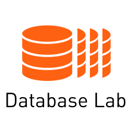
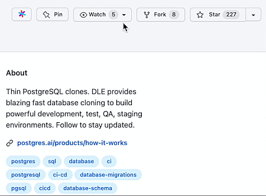

# Database Lab Engine - thin database clones for faster development

Database Lab Engine (DLE) is an open-source (AGPLv3) technology that allows blazing-fast cloning of Postgres databases of any size in seconds. This helps solve many problems such as:
- build dev/QA/staging environments involving full-size production-like databases,
- provide temporary full-size database clones for SQL query analysis optimization (see [Joe bot](https://gitlab.com/postgres-ai/joe)),
- automatically verify database migrations (DB schema changes) and massive data operations in CI/CD pipelines to minimize risks of downtime and performance degradation.

As an example, cloning a 10 TiB PostgreSQL database can take less than 2 seconds.

Read more at [Postgres.ai](https://postgres.ai) and in [the Docs](https://postgres.ai/docs).

## Useful links
### Tutorials
- [Database Lab tutorial for any PostgreSQL database](https://postgres.ai/docs/tutorials/database-lab-tutorial)
- [Database Lab tutorial for Amazon RDS](https://postgres.ai/docs/tutorials/database-lab-tutorial-amazon-rds)
### Reference guides
- [DLE components](https://postgres.ai/docs/reference-guides/database-lab-engine-components)
- [DLE configuration reference](https://postgres.ai/docs/database-lab/config-reference)
- [DLE API reference](https://postgres.ai/swagger-ui/dblab/)
- [Client CLI reference](https://postgres.ai/docs/database-lab/cli-reference)
### How-to guides
- [How to install Database Lab with Terraform on AWS](https://postgres.ai/docs/how-to-guides/administration/install-database-lab-with-terraform)
- [How to install and initialize Database Lab CLI](https://postgres.ai/docs/guides/cli/cli-install-init)
### Miscellaneous
- [DLE Docker images](https://hub.docker.com/r/postgresai/dblab-server)
- [Extended Docker images for PostgreSQL (with plenty of extensions)](https://hub.docker.com/r/postgresai/extended-postgres)
- [SQL Optimization chatbot (Joe Bot)](https://postgres.ai/docs/joe-bot)
- [DB Migration Checker](https://postgres.ai/docs/db-migration-checker)
- [Case Study: How Qiwi Controls the Data to Accelerate Development](https://postgres.ai/resources/case-studies/qiwi)
- [Case Study: How GitLab iterates on SQL performance optimization workflow to reduce downtime risks](https://postgres.ai/resources/case-studies/gitlab)

## Development
Open [an Issue](https://gitlab.com/postgres-ai/database-lab/-/issues) to discuss ideas, open [a Merge Request](https://gitlab.com/postgres-ai/database-lab/-/merge_requests) to propose a change.

See our [GitLab Container Registry](https://gitlab.com/postgres-ai/database-lab/container_registry) to find the images built for development branches.
<!-- TODO: SDK docs -->
<!-- TODO: Contribution guideline -->

### Development requirements
1. Install `golangci-lint`: https://github.com/golangci/golangci-lint#install

## Have a question?
- Check our [Q&A](https://postgres.ai/docs/questions-and-answers)
- or join our Community (links below)

## Community
- [Community Slack (English)](https://slack.postgres.ai)
- [Twitter](https://twitter.com/Database_Lab)

> Please support the project giving a GitLab star! It's on [the main page](https://gitlab.com/postgres-ai/database-lab), at the upper right corner:
>
> 
